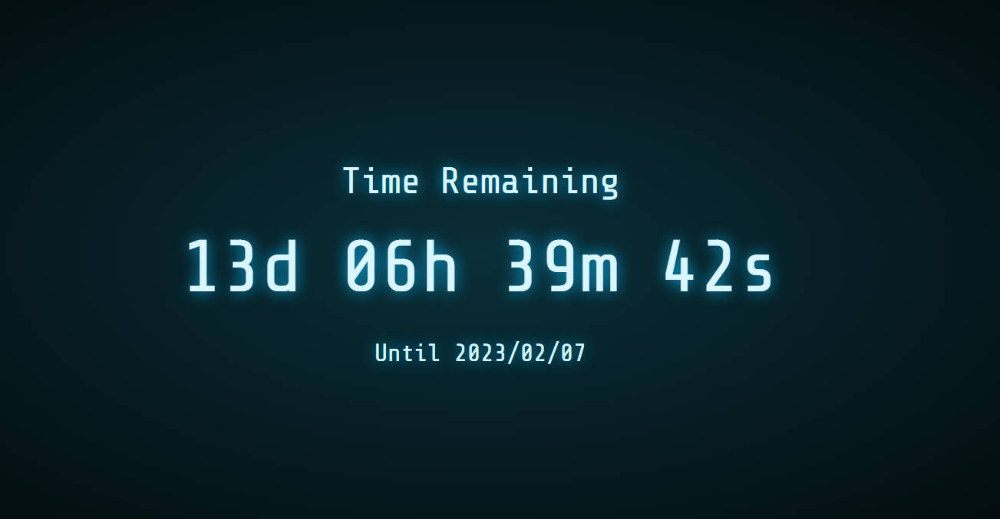

# Countdown

A simple countdown powered by Vue.js, inspired by [TAKAHASHI's Digital Clock](https://codepen.io/gau/pen/LjQwGp).

You can visit https://countdown.kifuan.me/ or use your custom date like https://countdown.kifuan.me/2023/02/08. You must provide **3 numbers** representing the year, month, and day.

It **works best on PC**, though mobiles are still adapted.

When the countdown ends, it will show `00d 00h 00m 00s` rather than negative numbers.

# Screenshot

